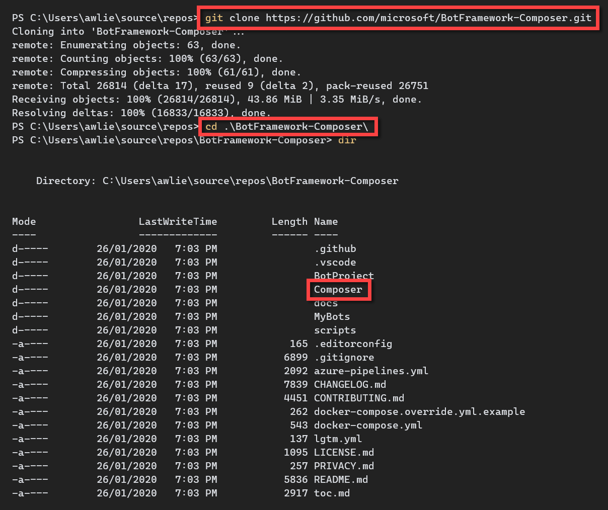
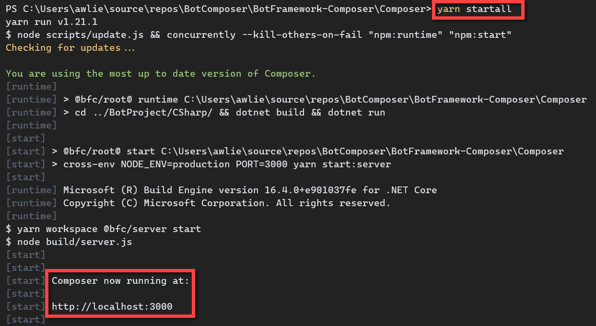
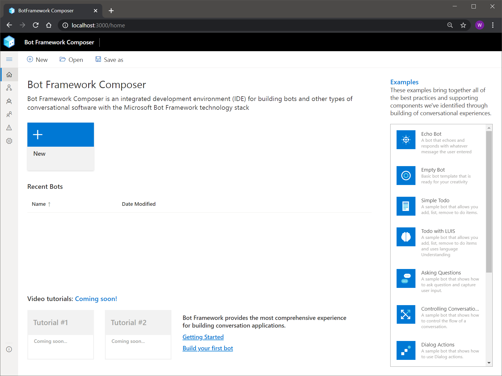

# Getting Started - Bot Composer

## Prerequisites

We need to install a few prerequisites before we can start up the Bot Composer.

- [Git](https://git-scm.com/downloads): latest version
- [Node.js](https://nodejs.org/dist/v12.13.0/): version 12.13.0
- [Yarn](https://yarnpkg.com/en/docs/install): latest stable version
- [Bot Framework Emulator](https://github.com/microsoft/BotFramework-Emulator/releases/latest): latest stable version
- [.NET Core SDK 2.2](https://dotnet.microsoft.com/download/dotnet-core/2.2): required to test your bot

## Get the code

First we need to get the code. So start by opening a terminal window and navigate to your favorite development / source folder. Clone the Bot Framework Composer GitHub repository to your local machine using the following command:

```
git clone https://github.com/microsoft/BotFramework-Composer.git
```



## Build the code

The `git clone` command creates a folder with the same name as the repository being cloned. 
Navigate to the newly cloned `BotFramework-Composer` folder. You can list the contents of this folder to see everything that you just cloned. Then navigate to the `Composer` folder.

To install all the dependencies run the following command:

```
yarn install
```

Next, we have to build the Bot Composer app by running the command:

```
yarn build 
```

Note: This can take few minutes.

### Troubleshooting

Sometimes you may have trouble getting the build to succeed. Running the `yarn tableflip` command will automatically delete, reinstall and rebuild all of the dependencies.

Follow through with `yarn install` and `yarn build` again. 

Note: This can take few minutes.

## Serving the Bot Composer

To start serving the Bot Composer, run the following command:

```
yarn startall
```

## Open Bot Composer

Composer is a web application. So once the web app has been `Compiled successfully`, open a browser and navigate to the address displayed. For example http://localhost:3000.





## More Documentation

[Common Expression Language ](https://github.com/microsoft/BotBuilder-Samples/tree/master/experimental/common-expression-language)

[Pre-built functions](https://github.com/microsoft/BotBuilder-Samples/blob/master/experimental/common-expression-language/prebuilt-functions.md)

[Language Generation (LG)](https://github.com/microsoft/BotBuilder-Samples/blob/master/experimental/language-generation/docs/lg-file-format.md)

[Memory Model](https://github.com/microsoft/BotBuilder-Samples/blob/master/experimental/adaptive-dialog/docs/memory-model-overview.md)

[Getting input from user](https://github.com/microsoft/BotFramework-Composer/blob/stable/docs/how-to-ask-for-user-input.md)